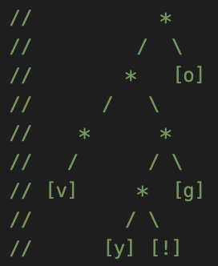
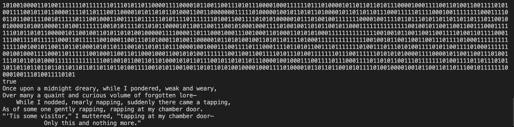

# Huffman-Coding-Trees
Tree-based data structure used for efficient data encoding and decoding with binary sequences.



### What I Learned
- Implement a tree-based data structure
- Concepts of fixed length encoding/decoding
- Using helper fucnctions to make this possible

Here is what the encoded and decoded versions look like!



## <a href="https://www.youtube.com/watch?v=UNz9k9E9IWM"> Demo Video on YouTube </a>

## Setup

If you want to play around with the Huffman Coding Trees, feel free to clone my repo. To start, please enter the following commands on your terminal:

```
git clone https://github.com/CamNagle24/Huffman-Coding-Trees
```
